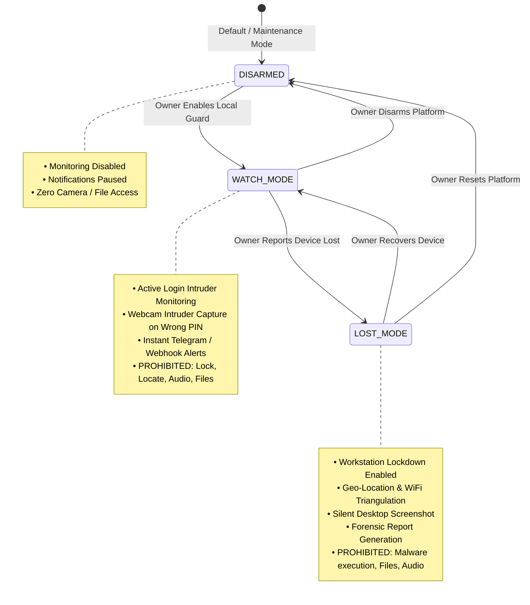
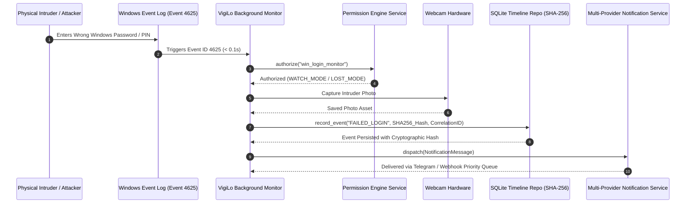

<div align="center">

# 🛡️ VigiLo — Privacy-First Windows Device Recovery Platform

[](https://opensource.org/licenses/MIT)
[](https://microsoft.com/windows)
[](https://python.org)
[](CONTRIBUTING.md)
[](docs/engineering_bible.md)
[](docs/threat_model.md)

*A commercial-grade, open-source, local-first Windows Device Recovery Platform built for absolute user trust, deterministic device state management, forensic evidence capture, multi-provider notifications, permanent identity, and enterprise security policies.*

[Features](#-key-features) • [Hardening Modules](#-phase-5-platform-hardening) • [State Machine](#-device-state-machine-graph) • [Architecture](#-system-architecture-graph) • [Data Flow](#-data-flow--incident-sequence-graph) • [Quick Start](#-quick-start) • [Contributing](CONTRIBUTING.md) • [License](#-license)

</div>

---

## 📌 Positioning Statement

VigiLo is **NOT** an antivirus, RAT, spyware, or generic endpoint security software.

It is a **Privacy-First Windows Device Recovery Platform**.

Every architectural decision reinforces **Trust, Transparency, Usability, and Reliability**.

- 🔒 **100% Local-First & Zero Cloud Dependencies**: Operates strictly on the owner's Windows machine. No external telemetry servers, third-party databases, or cloud tracking.
- 🚦 **Formal Device State Machine**: Strict feature scoping across `DISARMED`, `WATCH_MODE`, and `LOST_MODE`. Prohibits intrusive operations during normal local device usage.
- 🛡️ **Transparent Trust & Justification Framework**: Clear explanations presented for every OS permission requested (Camera, Admin, Event Logs).
- 📜 **Tamper-Evident Incident Timeline**: Persistent SQLite event logging with **SHA-256** cryptographic hash validation.
- 📋 **Forensic Report Generation**: Export verifiable PDF and JSON forensic reports formatted for personal records and law enforcement evidence.
- ❤️ **Push-Based Health Monitoring**: Real-time status aggregation across subsystems using an observer pattern with zero-polling CPU overhead.
- 🧙 **Guided Recovery Wizard**: Interactive 5-step desktop workflow guiding device owners through loss recovery, evidence collection, locking, and report generation.
- 🔑 **Permanent Device Identity Platform**: Hardware UUID, DPAPI-protected RSA keys, public fingerprint, and local self-signed certificates.
- 📬 **Notification Abstraction Layer**: Priority-queued delivery supporting Telegram, Webhooks, Email, Discord, and Push fallback with exponential backoff retries.

---

## ✨ Key Features

| Feature | Description | Scope / Access Rule |
| :--- | :--- | :--- |
| **Instant Login Intruder Detection** | Hooks into Windows Event ID 4625 (Failed Logon) for 0.1s detection | Allowed in `WATCH_MODE` & `LOST_MODE` |
| **Webcam Snapshot Capture** | Takes photo of intruder attempting physical login | Allowed in `WATCH_MODE` & `LOST_MODE` |
| **Multi-Provider Owner Alerts** | Transmits encrypted photo & text alerts via Telegram or Webhooks | Allowed in `WATCH_MODE` & `LOST_MODE` |
| **Remote Workstation Lock** | Triggers native Windows `LockWorkstation` API | Restricted to `LOST_MODE` |
| **Geo-Location & WiFi Triangulation** | Gathers IP geolocation & scans nearby BSSIDs for Wigle mapping | Restricted to `LOST_MODE` |
| **Silent Desktop Screenshot** | Takes snapshot of active desktop session | Restricted to `LOST_MODE` |
| **Permanent Device Identity** | Binds installation to machine UUID & RSA fingerprint | Available in all modes |
| **Secure Device Pairing** | Challenge-response pairing protocol with QR payload support | Available in all modes |
| **Tamper Detection Engine** | Real-time monitoring for service stops, file/registry tampering, and task disables | Available in all modes |
| **Centralized Permission Engine** | Single-point-of-truth authorization matrix checking State, Role, and Privilege | Available in all modes |
| **Centralized Security Gateway** | Single-point execution gateway for all privileged operations (Camera, Lock, File I/O) | Available in all modes |
| **Capability Registry** | Single source of truth describing 12 platform capabilities & danger levels | Available in all modes |
| **Feature Flag Framework** | Production tier flags (Community, Pro, Enterprise, Experimental) with env overrides | Available in all modes |
| **Command Authorization Pipeline** | Anti-replay nonces, timestamp skew checks, and rate-limiting | Available in all modes |
| **Self-Diagnostics Engine** | Automated hardware, memory, disk, and permission diagnostic checks | Available in all modes |
| **Fluent Device Control Center** | Commercial-grade MVVM desktop UI (Windows Security & Defender aesthetic) | Available in all modes |
| **Forensic Timeline Workbench** | Defender & CrowdStrike-style investigation UI supporting 16 event categories | Available in all modes |
| **Official Plugin SDK** | Type-safe SDK facade with capability sandboxing & plugin lifecycle management | Available in all modes |
| **Versioned Public API (v1)** | Backward-compatible facade for Runtime, Security, Timeline, Recovery, & Observability | Available in all modes |
| **Asynchronous EventBus** | Decoupled pub/sub messaging engine routing platform events | Available in all modes |
| **HMAC Webhook Engine** | Outgoing webhooks with HMAC-SHA256 request signing & exponential backoff retries | Available in all modes |
| **AST Scripting Engine** | Sandboxed automation rule execution (`When Incident -> Run Action`) | Available in all modes |
| **Extensible Theming & i18n** | Multi-language localization bundles and Dark / Light / High Contrast UI themes | Available in all modes |

---

## 🔒 Phase 5 Platform Hardening

VigiLo incorporates 12 enterprise-hardened subsystem modules:

1. **Notification Abstraction Layer**: `INotificationProvider` interface with exponential backoff retries, priority queueing, and provider degradation.
2. **Device Identity Platform**: Generates permanent machine UUIDs, RSA key pairs, and local public fingerprints stored via DPAPI.
3. **Secure Device Pairing System**: Challenge-response verification protocol with QR payload generation.
4. **Tamper Detection Engine**: Detects service stops, binary hash mismatches, registry changes, and disabled scheduled tasks.
5. **Centralized Permission Engine**: Policy matrix evaluating required device states, user roles, runtime privileges, and audit requirements.
6. **Security Policy Engine**: Declarative filesystem path restrictions, command whitelists, and recovery policies.
7. **Command Authorization Pipeline**: Enforces replay protection, nonce tracking, timestamp skew validation (<60s), and rate limits.
8. **Structured Observability Platform**: Real-time telemetry tracking CPU, RAM, active threads, queue sizes, and failure counts.
9. **Self-Diagnostics Engine**: Automated diagnostic probes for camera hardware, event log APIs, disk space, and notification providers.
10. **Unified Correlation ID Infrastructure**: Propagates `correlation_id`, `trace_id`, `audit_id`, `incident_id`, and `log_id` across all layers.
11. **Centralized Exception & Error Framework**: Structured hierarchy (`SecurityException`, `FatalException`, `RecoverableException`) eliminating silent failures.
12. **Release Hardening Manager**: Schema version checking, transactional config migrations, and rollback support.

---

## 🚦 Device State Machine Graph

VigiLo replaces always-active monitoring with a deterministic **Device State Engine**:



---

## 🏗️ System Architecture Graph

VigiLo strictly follows the **Controller -> Service -> Repository -> Model -> UI** pattern:

```mermaid
graph TD
    subgraph UI_Layer ["UI & Command Layer"]
        UI_Dash[Desktop Dashboard App]
        UI_Wiz[Guided Recovery Wizard]
        Cmd_Tg[Telegram / Webhook Command Center]
    end

    subgraph Controller_Layer ["Controller Layer (ServiceContainer DI)"]
        StateCtrl[DeviceStateController]
        IdentityCtrl[DeviceIdentityController]
        PairingCtrl[PairingController]
        AuthCtrl[CommandAuthorizationController]
        HealthCtrl[HealthController]
        DiagCtrl[DiagnosticsController]
    end

    subgraph Service_Layer ["Service Layer (IService Business Logic)"]
        StateSvc[DeviceStateService]
        IdentitySvc[DeviceIdentityService]
        PairingSvc[SecurePairingService]
        TamperSvc[TamperDetectionService]
        PermSvc[PermissionEngineService]
        PolicySvc[SecurityPolicyService]
        AuthSvc[CommandAuthorizationService]
        ObsSvc[ObservabilityService]
        DiagSvc[DiagnosticsEngineService]
        NotifSvc[NotificationService]
        ErrorSvc[CentralizedErrorService]
    end

    subgraph Repository_Layer ["Repository & Security Store"]
        StateRepo[DeviceStateRepository]
        IdentityRepo[DeviceIdentityRepository - DPAPI]
        TimelineRepo[TimelineRepository - SQLite]
        AuditRepo[AuditLogRepository]
        PolicyRepo[SecurityPolicyRepository]
    end

    subgraph OS_Layer ["Windows Platform & Crypto API"]
        WinEvtLog[Windows Security Event Log - Event 4625]
        WinAPI[Win32 LockWorkstation / Netsh WiFi]
        CryptoAPI[SHA-256 Integrity Engine]
    end

    UI_Dash --> IdentityCtrl
    UI_Dash --> PairingCtrl
    UI_Dash --> DiagCtrl
    Cmd_Tg --> AuthCtrl

    AuthCtrl --> AuthSvc
    IdentityCtrl --> IdentitySvc
    PairingCtrl --> PairingSvc
    DiagCtrl --> DiagSvc

    AuthSvc --> PermSvc
    AuthSvc --> PolicySvc
    IdentitySvc --> IdentityRepo
    TamperSvc --> AuditRepo
    TamperSvc --> TimelineRepo

    StateSvc --> StateRepo
    StateSvc --> WinEvtLog
```



---

## 🔄 Data Flow & Incident Sequence Graph

How VigiLo detects an intruder attempt, verifies feature permissions, hashes the record, and notifies the owner:



---

## 🎮 Telegram Control Center Commands

Owners can manage their device state and trigger recovery actions directly via Telegram:

```
🛡️ VigiLo Command Center
• /mode     - View current Device State
• /disarm   - Set state to DISARMED
• /watch    - Set state to WATCH MODE
• /lost     - Set state to LOST MODE
• /diagnose - Run automated Self-Diagnostics
• /identity - View Permanent Device Identity & Fingerprint
• /pair     - Initiate Secure Device Pairing
• /report   - Generate & upload Forensic PDF Report
• /timeline - View recent persistent incident log
• /trust    - View Privacy & Permission Justifications
• /ping     - Check platform status & uptime
• /capture  - Take webcam photo
• /screen   - Take desktop screenshot (Lost Mode)
• /locate   - Geolocation & WiFi Triangulation
• /lock     - Instantly Lock Workstation
• /msg      - Display emergency pop-up message
```

---

## 🚀 Quick Start

### 1. Prerequisites
- **Windows 10 / 11**
- **Python 3.10+**
- **Telegram Bot Token & Chat ID** (Obtained via [@BotFather](https://t.me/botfather))

### 2. Installation & Setup
```bash
# Clone repository
git clone https://github.com/diwakar2905/VigiLo.git
cd VigiLo

# Install python dependencies
pip install -r requirements.txt
```

### 3. Launch Desktop Dashboard
```bash
python -m src.ui.dashboard_app
```

---

## 🧪 Testing

VigiLo enforces **>= 95%** coverage target for all core business logic modules.

Run the test suite locally:
```bash
python -m pytest tests/
```

---

## 👥 Open Source Contribution

We welcome contributions from open-source developers, Windows engineers, and security researchers!

Please review our:
- 📖 [User Guide](docs/user_guide.md)
- 🏛️ [Architecture Decision Records (ADRs)](docs/adr.md)
- 📖 [Contribution Guidelines](CONTRIBUTING.md)
- 📐 [Engineering Bible](docs/engineering_bible.md)
- 🔒 [Threat Model & Security Policy](docs/threat_model.md)
- 📜 [Contributor Code of Conduct](CODE_OF_CONDUCT.md)

---

## 📄 License

VigiLo is licensed under the **MIT License**. See the [LICENSE](file:///c:/Users/diwak/Downloads/WatchDog-61675e7fe6254baf87bd0b158efba4b9e6192b34/WatchDog-61675e7fe6254baf87bd0b158efba4b9e6192b34/LICENSE) file for complete details.
