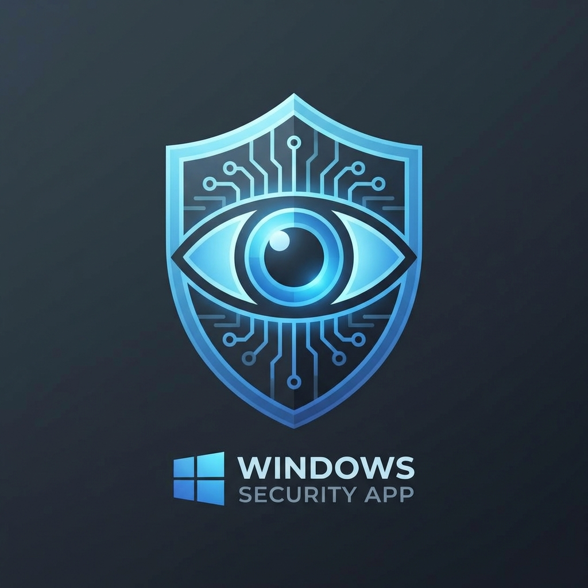
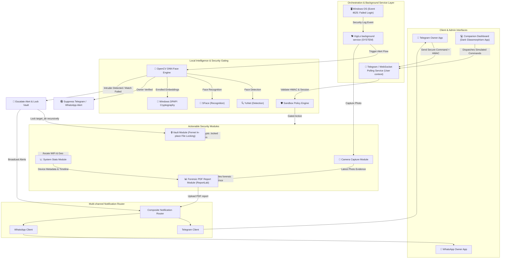

# 🛡️ VigiLo v2 — Recovery & Data Protection Platform

### Privacy-First Windows Intrusion Detection, Local AI Intelligence & Device Recovery Platform

VigiLo v2 transforms the workstation security agent into a comprehensive, multi-layered data protection and recovery system. Know immediately when someone tries to access your Windows PC, verify identity locally using AI, lock down sensitive folders, and command your system remotely via Telegram or WhatsApp while monitoring your fleet through a glassmorphic dashboard.

---



---

## ⚡ Key Highlights in v2

*   🧠 **Offline Local Face Verification**: Integrates local face matching utilizing OpenCV YuNet (detection) and SFace (recognition) ONNX models with a `0.363` cosine similarity threshold.
*   🔐 **DPAPI Configuration Gating**: Securely encrypts and stores all facial embeddings and Telegram/WhatsApp credentials using native Windows Data Protection API (DPAPI).
*   🔇 **AI-Powered False-Alarm Suppression**: Automatically suppresses Telegram/WhatsApp alerts if the owner's face is detected during a login failure, keeping a detailed log of events.
*   🔒 **Data Protection Vault**: Implements Fernet-based recursive, in-place folder encryption (`.locked`). Initiates automatic lockouts upon unauthorized access.
*   📊 **Forensic PDF Compilation**: Aggregates OS details, network interfaces, MAC address, boot time, face verification statistics, and intruder photo evidence into a letter-size police/insurance-ready PDF report.
*   📡 **Multi-Channel Notification Router**: Simultaneously broadcasts text, photos, audio, and documents to Telegram and WhatsApp Business Cloud API channels.
*   💻 **Dark Glassmorphic Fleet Companion Dashboard**: A sleek, client-side dashboard (`companion_dashboard/index.html`) featuring interactive device grids, live security feeds, geolocation simulation, and a remote terminal console.

---

## 📐 System Architecture Diagram

VigiLo v2 operates as a decoupled, multi-layered security application. Below is the system topology showing the telemetry, intelligence, and reporting channels:



---

## 🚀 Quick Start & Enrollment Walkthrough

### 1. Prerequisite Channels Setup
*   **Telegram Bot**: Open Telegram, search for [@BotFather](https://t.me/BotFather), send `/newbot`, and save your **API Bot Token**. Find your chat ID by message interaction and fetching `https://api.telegram.org/bot<YOUR_TOKEN>/getUpdates`.
*   **WhatsApp Business API (Optional)**: Set up a WhatsApp Business account on the Meta Developer Portal, obtain a **Phone Number ID**, **Graph API Token**, and set up the recipient phone number.

### 2. Run the Installation Wizard
Launch the GUI installer using Python (or run the compiled setup executable):
```bash
python setup/install_wizard.py
```
1.  **Configuration Page**: Enter your Telegram Bot Token, Chat ID, and WhatsApp details. Set the target folder path to secure.
2.  **Face Enrollment Page**: The wizard will prompt you to register your face. Look directly into the webcam:
    *   It will automatically capture **5 reference shots**.
    *   Extract facial embeddings locally via YuNet/SFace.
    *   Encrypt and register the embeddings via **Windows DPAPI**.
3.  **Install Page**: The engine compiles the environment settings, copies VigiLo executables, and registers the Windows Task Scheduler background service.

### 3. Launching the Fleet Companion Dashboard
Open [companion_dashboard/index.html](companion_dashboard/index.html) in your browser:
*   Configure the active device from the dashboard grid.
*   Interact with the **Terminal Console** and command buttons.
*   Simulate commands and review the **Live Security Feed** stream.

---

## 🎮 Telegram Remote Command Center

All remote commands must be sent to your configured Telegram Bot with a signed HMAC-SHA256 token suffix for authorization (enforcing sandbox isolation and command replay protection).

| Command | Action Description | SRE / Security Outcome |
| :--- | :--- | :--- |
| `/ping` | Verify if the security agent is active. | Returns interactive ping confirmation. |
| `/capture` | Instantly trigger webcam and upload image. | Takes photo under 0.5s; delivers as message. |
| `/screen` | Capture silent full-screen desktop screenshot. | Monitors current screen activity. |
| `/listen [sec]`| Record microphone ambient audio (max 30s). | Delivers `.wav` file; wipes from device. |
| `/stat` | Read CPU, Memory, Disk, and Boot time statistics. | Analyzes live resource footprints. |
| `/locate` | Query nearby BSSIDs and perform IP Geolocation. | Returns maps link + WiFi triangulation list. |
| `/lock` | Instantly locks the Windows workstation. | Forces standard Windows workstation lock. |
| `/unlock` | Decrypts target directories, restoring files. | Restores Fernet-encrypted files in-place. |
| `/report` | Compiles forensic PDF report and sends to chat. | Builds ReportLab PDF with metadata + photo; wipes file. |
| `/msg "text"`| Display warning popups and speak alert aloud. | Alerts intruder of recovery procedures. |

---

## 📁 Repository Structure

```
├── api/                    # Notification engines (Telegram, WhatsApp Cloud API)
├── companion_dashboard/    # Glassmorphism HTML/CSS/JS fleet dashboard
├── config/                 # Atomic loader, saver, and migration handlers
├── core/                   # Event logs monitor, installer & service orchestration engines
├── docs/                   # Complete engineering bibles and audits
├── modules/                # Feature modules (Face, Vault, Report, Camera, Geo, Audio)
├── security/               # HMAC Auth, DPAPI Encryption, Sandbox Policy Engine
├── services/               # Telegram polling, upload queues, and persistence
├── setup/                  # Install wizards, GUI configs, and spec setups
├── tests/                  # Verification suite (105 tests)
└── main.py                 # Core application entrypoint
```

---

## 🛡️ Trust & Security Disclosures

*   **100% Client-Side**: Credentials and face profiles never leave your machine except when sent directly to your Telegram/WhatsApp chat.
*   **Coordinated Vulnerability Disclosures**: Please report vulnerability discoveries via the process outlined in [SECURITY.md](SECURITY.md).
*   **Software License**: Licensed under the [MIT License](LICENSE).

---

**Developed with 🐕 by Diwakar Mishra and the VigiLo Open Source Contributors.**
