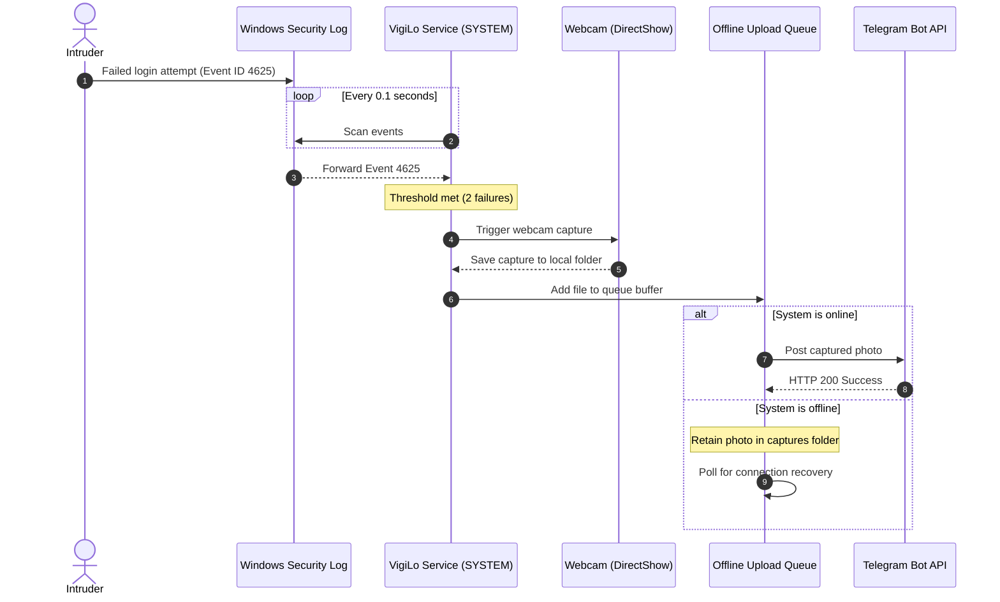

# 🔒 VigiLo: Production-Grade Windows Anti-Theft & Remote Commander

[](LICENSE)
[](#)
[](CHANGELOG.md)
[](CONTRIBUTING.md)

VigiLo (formerly WatchDog) is an enterprise-grade endpoint security agent designed to protect Windows laptops from physical theft and unauthorized access. Running as a silent, high-privilege system background task, it catches intrusion events, photographs intruders, records telemetry, and streams evidence directly to your private Telegram channel.

It also serves as an encrypted remote administration node, permitting you to lock, locate, and audit your PC securely via Telegram commands.

---

## 📐 System Flow Diagram

The sequence below illustrates how VigiLo captures intrusion events and handles secure transfers:



---

## ⚡ Core Features

*   🚀 **Instant Intrusion Sensing**: Inspects the Windows Event Log for Event ID `4625` (Wrong Password) with a polling speed of `0.1s`.
*   📸 **Zero Warm-Up Capture**: Fires the camera via DirectShow (`cv2.CAP_DSHOW`), shortening shutter lag to less than **50ms**.
*   🔒 **DPAPI Encryption**: Automatically protects Bot Tokens and Chat IDs on disk using the native Windows Data Protection API (DPAPI).
*   🛡️ **Anti-Hijacking DACLs**: Restricts folder permissions in `C:\Program Files\VigiLo` to `SYSTEM` and `Administrators`, preventing DLL side-loading.
*   ⛓️ **Single-Instance Mutex**: Enforces process isolation via Win32 named Mutex blocks to prevent hardware resource locks.
*   🔄 **Auto-Recovery**: Safely re-anchors event pointers when logs wrap or are cleared, eliminating CPU exception spikes.
*   🌐 **Resilient Upload Queue**: Safely stores photos in an offline buffer and uploads them immediately when internet connection returns.

---

## 📱 Telegram Command Console

Control your workstation remotely using these commands:

| Command | Icon | Description | Context |
| :--- | :---: | :--- | :--- |
| `/ping` | 📡 | Verify if the system agent is online and listening. | User |
| `/capture` | 📸 | Instantly take a photo using the webcam. | User |
| `/listen [sec]`| 🎤 | Record audio from the microphone (default 5s). | User |
| `/screen` | 🖥️ | Take a silent screenshot of the desktop. | User |
| `/stat` | 📊 | Get CPU, RAM, Disk space, Battery, and Boot time. | User |
| `/locate` | 📍 | Geolocate device (IP GeoIP + WiFi spectrum scan). | User |
| `/ls`, `/cd` | 📂 | Browse files securely (sandboxed to User Profile). | User |
| `/download [file]`| ⬇️ | Download a file from the device. | User |
| `/lock` | 🔒 | Instantly lock the Windows workstation. | User |
| `/msg "text"` | 🔔 | Display a popup and play a text-to-speech alert on screen. | User |
| `/help` | ❓ | View help details. | User |

---

## 📂 Project Architecture

```
VigiLo/
├── api/             # Outbound Telegram API clients
├── config/          # Configurations parsing, schemas, and DPAPI managers
├── core/            # System monitors, lifecycle engines, and deployment engines
├── logs/            # Rotating file logs manager (5MB limits)
├── modules/         # Feature modules (camera, audio, screenshot, files, locate)
├── security/        # DPAPI encryption, path sanitizers, and UAC controls
├── services/        # Telegram Poller and offline upload queue workers
├── setup/           # Spec files, icons, logos, and compiler scripts
├── ui/              # Dark stylesheet and wizard UI screens
├── dist/            # Compiled binaries output folder
├── main.py          # Unified entry point launcher
└── requirements.txt # Python package requirements
```

---

## 🛠️ Installation & Setup Guide

### Step 1: Create a Telegram Bot
1. Open Telegram and search for the official [**@BotFather**](https://t.me/BotFather).
2. Send the command `/newbot`.
3. Choose a display name and username (must end in `bot`, e.g., `MyVigiLoBot`).
4. Copy the generated **Bot Token**.

### Step 2: Retrieve Your Chat ID
1. Search for your new bot on Telegram and click **Start**.
2. Send any message (e.g., "Hello") to the bot.
3. Open your browser and visit:
   `https://api.telegram.org/bot<YOUR_BOT_TOKEN>/getUpdates`
4. Copy the `id` value under the `chat` block (e.g., `123456789`).

### Step 3: Run the Setup Wizard
1. Download and run [**`VigiLo_Setup.exe`**](dist/VigiLo_Setup.exe).
2. Accept the EULA terms.
3. Paste your **Bot Token** and **Chat ID**.
4. Click **Install** to deploy.

---

## 💻 Developer Guide & Local Compilation

If you want to run the project in development mode or build custom executables:

### Requirements:
*   Python 3.10+
*   Windows 10 or 11
*   Webcam and Microphone

### 1. Install Dependencies:
```bash
pip install -r requirements.txt pyinstaller
```

### 2. Run from Source:
*   **Service Daemon (Event monitoring)**:
    ```bash
    python main.py --service
    ```
*   **Commander Polling (Command listener)**:
    ```bash
    python main.py --commander
    ```

### 3. Rebuild Executables:
To build the binaries (`VigiLo.exe`, `uninstall.exe`, and `VigiLo_Setup.exe`), run:
```bash
python setup/install_startup.py
```

---

## 🤝 Contributing to VigiLo

We welcome contributions of all types! Whether you want to improve security, optimize performance, build new dashboard elements, or fix bugs, your help is appreciated.

### Getting Started:
1.  Review our [Contributing Guidelines](CONTRIBUTING.md) to align on our clean architecture standards.
2.  Fork this repository.
3.  Create a feature branch: `git checkout -b feature/awesome-feature`.
4.  Commit your changes: `git commit -m "feat: add awesome feature"`.
5.  Push to your branch and open a Pull Request.

---

## 🛡️ Security Vulnerabilities
If you identify a security issue, please review our [Security Policy](SECURITY.md) to report it privately. Do not open public issues for security vulnerabilities.

---

## 📄 License
This project is licensed under the [MIT License](LICENSE).

---

**Made with 🐕 by Diwakar Mishra and the VigiLo Open Source Contributors.**
