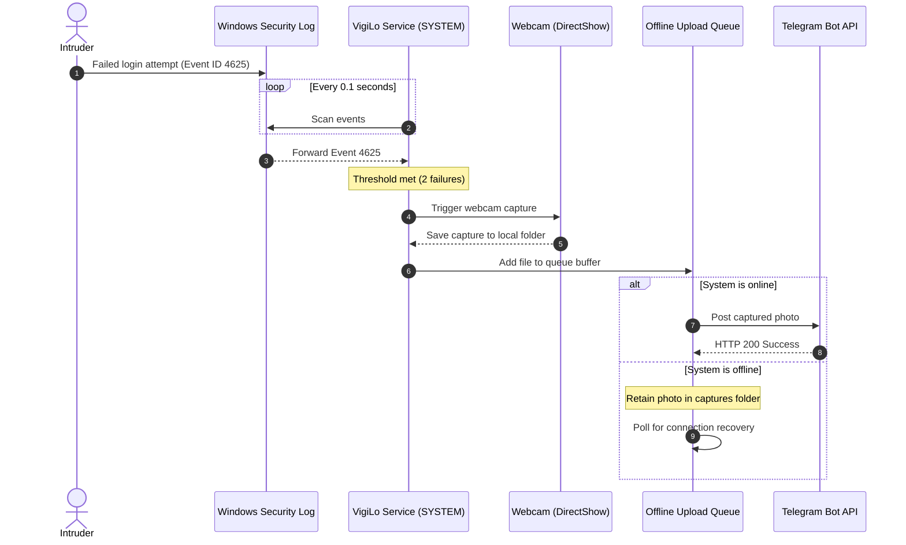

# 🔒 VigiLo: Production-Grade Windows Endpoint Protection & Remote Commander

[](LICENSE)
[](#)
[](CHANGELOG.md)
[](CONTRIBUTING.md)

VigiLo is a privacy-first, open-source Windows endpoint protection and recovery platform. Running as a resilient background service, it detects intrusion events, captures webcam photos on login failures, and updates you directly via your private Telegram bot. It also acts as an encrypted remote administration node, letting you lock, locate, and audit your PC securely.

---

## 📖 Complete Documentation
For detailed explanations of our architecture, threat models, SRE supervisor configurations, and Windows integration details, please refer to the:
👉 **[VigiLo Engineering & Product Bible v1.0](docs/README.md)**

---

## 📐 System Flow Diagram



---

## ⚡ Core Features

### ⚙️ Production-Grade Configuration Service
*   **Atomic Saves**: Writes configuration changes to a `.tmp` file and commits them using `os.replace` to prevent corruption.
*   **Rolling Backups**: Keeps a history of the last 5 valid configurations and automatically recovers from backup if corruption is detected.
*   **Precedence Resolution**: Resolves configuration settings dynamically using the hierarchy: Command Line > Environment Variables > JSON Config File > Defaults.
*   **Immutable Snapshots**: Enforces read-only snapshot rules on configuration properties at runtime.

### 🛡️ Hardened Security Core
*   **Declarative Access**: Restricts feature module execution via a centralized `PermissionMatrix`.
*   **Structured Auditing**: Every access evaluation registers structured JSON entries with sequential `AUD-XXXXXX` event IDs.
*   **Cryptographic Boundaries**: Sensitive API credentials are encrypted at rest using Windows DPAPI.
*   **Secure Memory Wiping**: Wipes decrypted credentials from memory buffers using `ctypes` memory zeroing.

### 🔄 Resilient Runtime Host
*   **Dependency Resolution**: Service startups are sorted topologically to boot dependencies in the correct order.
*   **Thread Watchdog**: Monitors heartbeats and recovers crashed background threads using an exponential backoff delay ladder.
*   **Managed Threads**: Background threads run using `ManagedThread` classes that support cancellation events and clean joins on shutdown.

---

## 📱 Telegram Command Console

Control your workstation remotely using these commands:

| Command | Icon | Description | Context |
| :--- | :---: | :--- | :--- |
| `/ping` | 📡 | Verify if the system agent is online and listening. | User |
| `/capture` | 📸 | Instantly take a photo using the webcam. | User |
| `/listen [sec]`| 🎤 | Record audio from the microphone (default 5s). | User |
| `/screen` | 🖥️ | Take a silent screenshot of the desktop. | User |
| `/stat` | 📊 | Get CPU, RAM, Disk space, Battery, and Boot time. | User |
| `/locate` | 📍 | Geolocate device (IP GeoIP + WiFi spectrum scan). | User |
| `/ls`, `/cd` | 📂 | Browse files securely (sandboxed to User Profile). | User |
| `/download [file]`| ⬇️ | Download a file from the device. | User |
| `/lock` | 🔒 | Instantly lock the Windows workstation. | User |
| `/msg "text"` | 🔔 | Display a popup and play a text-to-speech alert on screen. | User |
| `/help` | ❓ | View help details. | User |

---

## 🛠️ Installation & Setup Guide

### Step 1: Create a Telegram Bot
1. Open Telegram and search for the official [**@BotFather**](https://t.me/BotFather).
2. Send the command `/newbot`.
3. Choose a display name and username (must end in `bot`, e.g., `MyVigiLoBot`).
4. Copy the generated **Bot Token**.

### Step 2: Retrieve Your Chat ID
1. Search for your new bot on Telegram and click **Start**.
2. Send any message (e.g., "Hello") to the bot.
3. Open your browser and visit:
   `https://api.telegram.org/bot<YOUR_BOT_TOKEN>/getUpdates`
4. Copy the `id` value under the `chat` block (e.g., `123456789`).

### Step 3: Run the Setup Wizard
1. Download and run [**`VigiLo_Setup.exe`**](dist/VigiLo_Setup.exe).
2. Accept the EULA terms.
3. Paste your **Bot Token** and **Chat ID**.
4. Click **Install** to deploy.

---

## 💻 Developer Guide & Local Compilation

### Requirements:
*   Python 3.10+
*   Windows 10 or 11
*   Webcam and Microphone

### 1. Install Dependencies:
```bash
pip install -r requirements.txt pyinstaller
```

### 2. Run Unit Tests:
```bash
cmd /c "set PYTHONPATH=. && python tests/test_runtime.py"
```

### 3. Run from Source:
*   **Service Daemon (Event monitoring)**:
    ```bash
    python main.py --service
    ```
*   **Commander Polling (Command listener)**:
    ```bash
    python main.py --commander
    ```

### 4. Rebuild Executables:
To compile the binaries (`VigiLo.exe`, `uninstall.exe`, and `VigiLo_Setup.exe`), run:
```bash
python setup/install_startup.py
```

---

## 🤝 Contributing to VigiLo
We welcome contributions of all types! Review our [Contribution Guide](docs/06_open_source_and_adr.md) and open a pull request.

---

## 🛡️ Security Vulnerabilities
If you identify a security issue, please review our [Security Policy](SECURITY.md) to report it privately. Do not open public issues for security vulnerabilities.

---

## 📄 License
This project is licensed under the [MIT License](LICENSE).

---

**Made with 🐕 by Diwakar Mishra and the VigiLo Open Source Contributors.**
