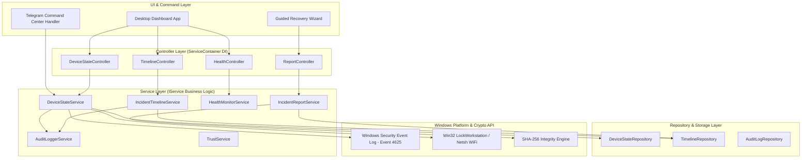
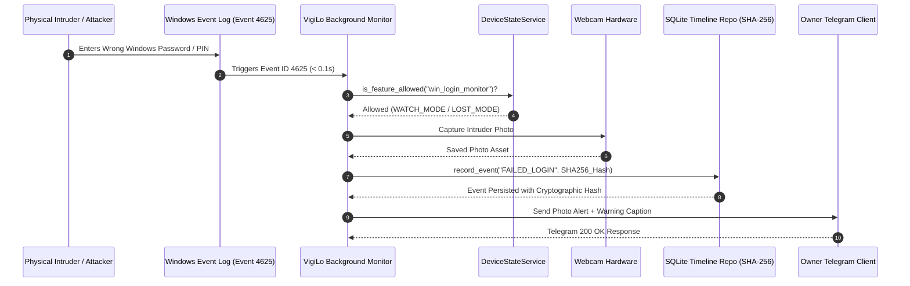
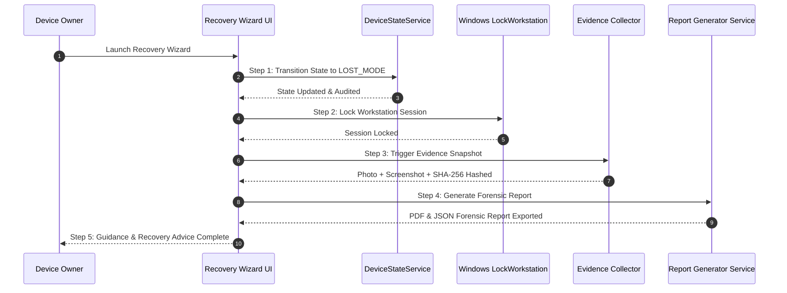

<div align="center">

# 🛡️ VigiLo — Privacy-First Windows Device Recovery Platform

[](https://opensource.org/licenses/MIT)
[](https://microsoft.com/windows)
[](https://python.org)
[](CONTRIBUTING.md)
[](docs/engineering_bible.md)

*A commercial-grade, open-source, local-first Windows Device Recovery Platform built for absolute user trust, deterministic device state management, forensic evidence capture, and transparent platform security.*

[Features](#-key-features) • [State Machine](#-device-state-machine-graph) • [Architecture](#-system-architecture-graph) • [Data Flow](#-data-flow--incident-sequence-graph) • [Quick Start](#-quick-start) • [Contributing](CONTRIBUTING.md) • [License](#-license)

</div>

---

## 📌 Positioning Statement

VigiLo is **NOT** an antivirus, RAT, spyware, or generic endpoint security software.

It is a **Privacy-First Windows Device Recovery Platform**.

Every architectural decision reinforces **Trust, Transparency, Usability, and Reliability**.

- 🔒 **100% Local-First & Zero Cloud Dependencies**: Operates strictly on the owner's Windows machine. No external telemetry servers, third-party databases, or cloud tracking.
- 🚦 **Formal Device State Machine**: Strict feature scoping across `DISARMED`, `WATCH_MODE`, and `LOST_MODE`. Prohibits intrusive operations during normal local device usage.
- 🛡️ **Transparent Trust & Justification Framework**: Clear explanations presented for every OS permission requested (Camera, Admin, Event Logs).
- 📜 **Tamper-Evident Incident Timeline**: Persistent SQLite event logging with **SHA-256** cryptographic hash validation.
- 📋 **Forensic Report Generation**: Export verifiable PDF and JSON forensic reports formatted for personal records and law enforcement evidence.
- ❤️ **Push-Based Health Monitoring**: Real-time status aggregation across subsystems using an observer pattern with zero-polling CPU overhead.
- 🧙 **Guided Recovery Wizard**: Interactive 5-step desktop workflow guiding device owners through loss recovery, evidence collection, locking, and report generation.

---

## ✨ Key Features

| Feature | Description | Scope / Access Rule |
| :--- | :--- | :--- |
| **Instant Login Intruder Detection** | Hooks into Windows Event ID 4625 (Failed Logon) for 0.1s detection | Allowed in `WATCH_MODE` & `LOST_MODE` |
| **Webcam Snapshot Capture** | Takes photo of intruder attempting physical login | Allowed in `WATCH_MODE` & `LOST_MODE` |
| **Telegram Owner Alerts** | Transmits encrypted photo alerts directly to owner's Telegram bot | Allowed in `WATCH_MODE` & `LOST_MODE` |
| **Remote Workstation Lock** | Triggers native Windows `LockWorkstation` API | Restricted to `LOST_MODE` |
| **Geo-Location & WiFi Triangulation** | Gathers IP geolocation & scans nearby BSSIDs for Wigle mapping | Restricted to `LOST_MODE` |
| **Silent Desktop Screenshot** | Takes snapshot of active desktop session | Restricted to `LOST_MODE` |
| **Tamper-Evident Report Generator** | Exports cryptographically verified PDF/JSON forensic reports | Available in all modes |
| **Desktop Management Dashboard** | Professional 7-tab GUI application (`Home`, `Protection`, `Timeline`, `Health`, `Logs`, `Settings`, `About`) | Available in all modes |

---

## 🚦 Device State Machine Graph

VigiLo replaces always-active monitoring with a deterministic **Device State Engine**:


---

## 🏗️ System Architecture Graph

VigiLo strictly follows the **Controller -> Service -> Repository -> Model -> UI** pattern:



---

## 🔄 Data Flow & Incident Sequence Graph

How VigiLo detects an intruder attempt, verifies feature permissions, hashes the record, and notifies the owner:



---

## 🧙 Guided Recovery Wizard Sequence Graph



---

## 🎮 Telegram Control Center Commands

Owners can manage their device state and trigger recovery actions directly via Telegram:

```
🛡️ VigiLo Command Center
• /mode     - View current Device State
• /disarm   - Set state to DISARMED
• /watch    - Set state to WATCH MODE
• /lost     - Set state to LOST MODE
• /report   - Generate & upload Forensic PDF Report
• /timeline - View recent persistent incident log
• /trust    - View Privacy & Permission Justifications
• /ping     - Check platform status & uptime
• /capture  - Take webcam photo
• /screen   - Take desktop screenshot (Lost Mode)
• /locate   - Geolocation & WiFi Triangulation
• /lock     - Instantly Lock Workstation
• /msg      - Display emergency pop-up message
```

---

## 🚀 Quick Start

### 1. Prerequisites
- **Windows 10 / 11**
- **Python 3.10+**
- **Telegram Bot Token & Chat ID** (Obtained via [@BotFather](https://t.me/botfather))

### 2. Installation & Setup
```bash
# Clone repository
git clone https://github.com/diwakar2905/VigiLo.git
cd VigiLo

# Install python dependencies
pip install -r requirements.txt
```

### 3. Launch Desktop Dashboard
```bash
python -m src.ui.dashboard_app
```

---

## 🧪 Testing

VigiLo enforces **>= 95%** coverage target for all core business logic modules.

Run the test suite locally:
```bash
python -m pytest tests/
```

---

## 👥 Open Source Contribution

We welcome contributions from open-source developers, Windows engineers, and security researchers!

Please review our:
- 📖 [Contribution Guidelines](CONTRIBUTING.md)
- 📐 [Engineering Bible](docs/engineering_bible.md)
- 🔒 [Threat Model & Security Policy](docs/threat_model.md)
- 📜 [Contributor Code of Conduct](CODE_OF_CONDUCT.md)

---

## 📄 License

VigiLo is licensed under the **MIT License**. See the [LICENSE](file:///c:/Users/diwak/Downloads/WatchDog-61675e7fe6254baf87bd0b158efba4b9e6192b34/WatchDog-61675e7fe6254baf87bd0b158efba4b9e6192b34/LICENSE) file for complete details.
