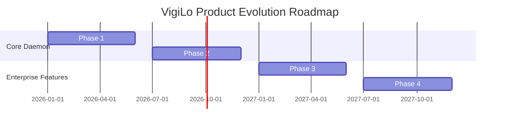

# PART I — Vision & Product

---

## Chapter 1 — Product Vision & Philosophy

### 1. Problem Statement
Windows endpoints are subject to physical theft, unauthorized local access, and remote command exploitation. Existing surveillance solutions are either closed-source, collect excessive private user telemetry, or are complex to configure for non-technical users.

### 2. Mission & Vision
*   **Mission**: Provide local-first, privacy-respecting physical and remote endpoint monitoring for Windows.
*   **Vision**: Build a transparent, open-source security tool that keeps data on the user's local machine and alerts them directly via secure channels.

### 3. Core Principles
*   **Privacy First**: No webcam captures, screenshots, or logs are uploaded to third-party cloud servers. All alerts go directly to the user's private Telegram bot.
*   **Low Footprint**: The background monitoring service must run with minimal resource usage, keeping idle CPU usage below 1%.

---

## Chapter 2 — Product Requirements Document (PRD)

### 1. Functional Requirements
*   **Intruder Capture**: Monitors Windows Security Event Logs for failed logon attempts (Event ID 4625) and captures webcam photos upon exceeding a defined threshold.
*   **System Event Notifications**: Alerts the user immediately when system shutdown is initiated.
*   **Remote Control Pipeline**: Supports remote command execution (lock computer, capture screen, capture photo) initiated via the Telegram bot.

### 2. Non-Functional Requirements
*   **Type Safety**: 100% type annotations across all core components.
*   **Resiliency**: Auto-recovery from service crashes using exponential backoff logic.
*   **Security**: Encrypts configuration secrets at rest using Windows DPAPI.

---

## Chapter 3 — Product Positioning & Roadmap

### 1. Target Audience
*   **Personal Users**: Security-conscious laptop owners.
*   **Professionals**: Remote workers storing sensitive customer data locally.
*   **Small Businesses**: Asset tracking for unmanaged endpoints.

### 2. Multi-Year Future Roadmap

